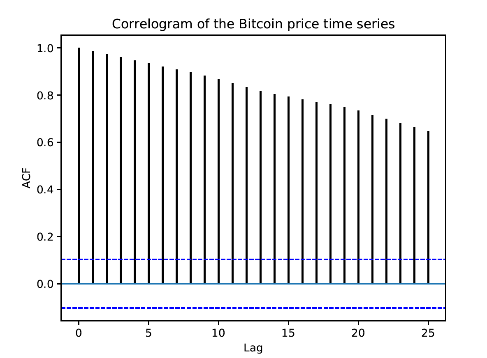
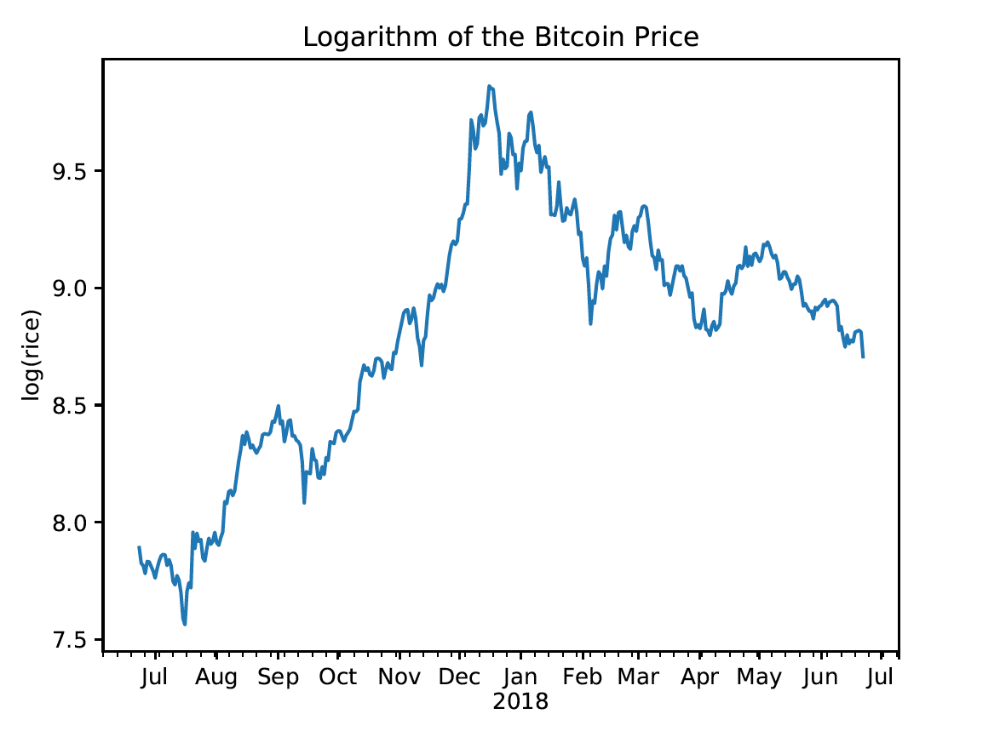
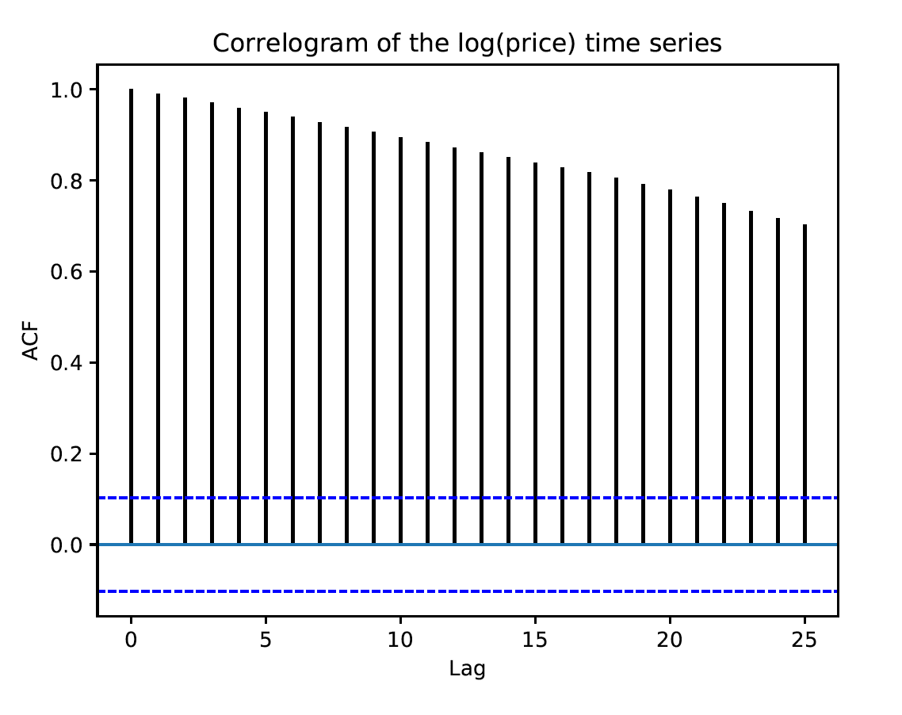
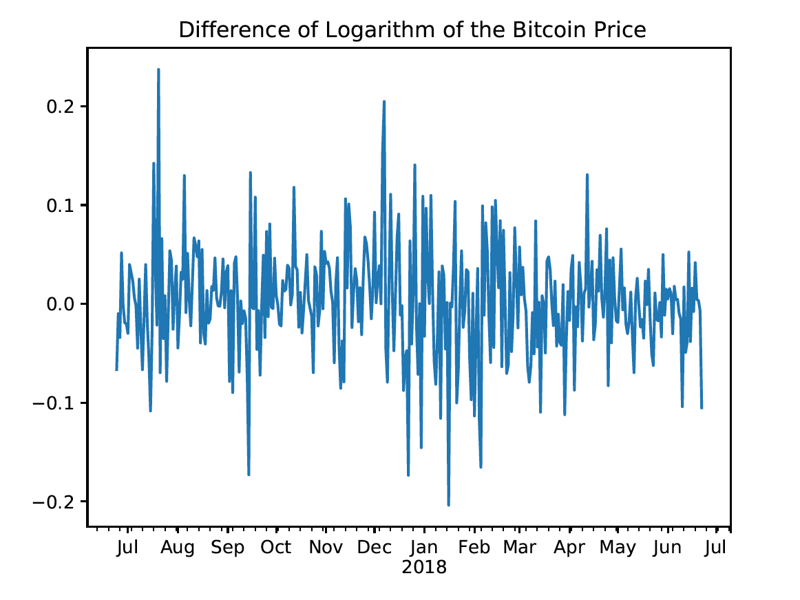

[](http://quantlet.de/)

## [](http://quantlet.de/) **TSP_BTC** [](http://quantlet.de/)

```yaml


Name of Quantlet:    'TSP_BTC'

Published in:        'Applied Time Series Analysis and Forecasting with Python'

Description:         'This Quantlet produces plots of closing daily prices, log-returns and their ACF for Time series of BTC daily prices from June 23, 2017 to June 22, 2018.'

Keywords:            'time series, BTC, Bitcoin, autocorrelation, log-returns'

Author[New]:         Huang Changquan, Alla Petukhina

Datafile:            BitcoinPrice17-6-23-18-6-22.xlsx


```











### PYTHON Code
```python

import pandas as pd
import numpy as np
bitcoin = pd.read_excel('BitcoinPrice 17 6 23 18 6 22.xlsx', header = 0)
dat = pd.date_range('2017 06 23', periods = len(bitcoin),freq = 'D')
bitcoin.index = dat
price = bitcoin['ClosingP']
import matplotlib.pyplot as plt
price.plot(); plt.title('Bitcoin Price 2017.6.23 2018.6.22')
plt.ylabel('Price in USD'); plt.show()
from PythonTsa.plot_acf_pacf import acf_pacf_fig
acf_pacf_fig(price, lag = 25)
logp = np.log(price)
logp.plot(); plt.title('Logarithm of the Bitcoin Price')
plt.ylabel('log(rice)'); plt.show()
acf_pacf_fig(logp, lag = 25)
dlogp = logp.diff(1)
dlogp = dlogp.dropna() #delete "NaN"
dlogp.plot()
plt.title('Difference of Logarithm of the Bitcoin Price')
plt.show()
acf_pacf_fig(dlogp, lag = 25)
```

automatically created on 2021-01-11