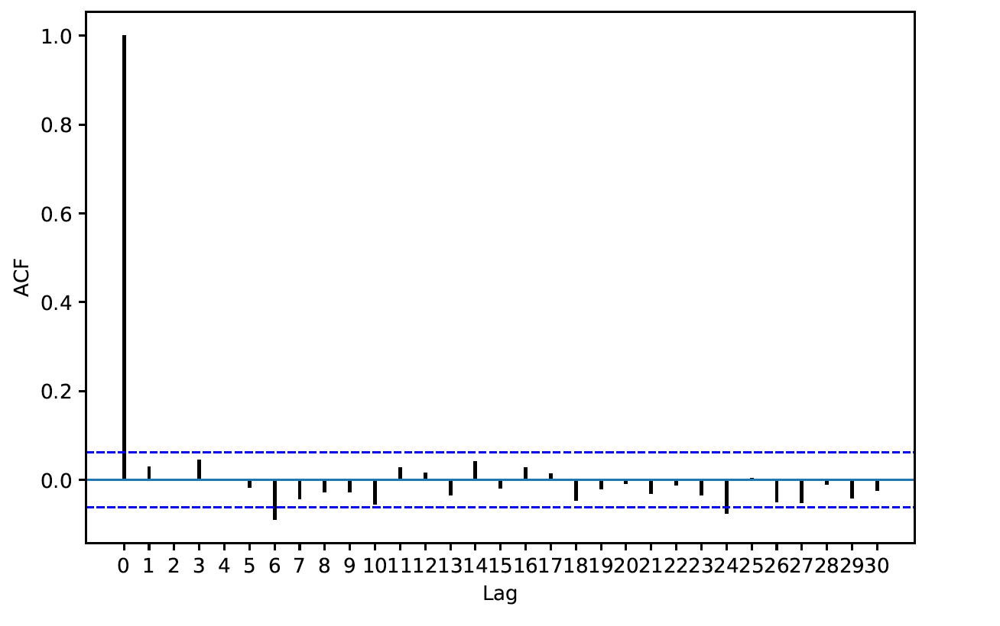
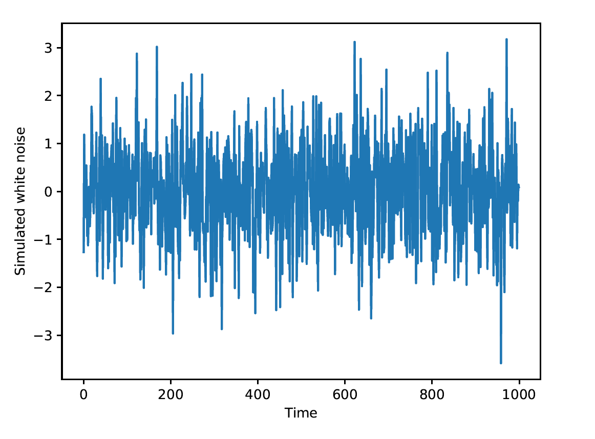

[](http://quantlet.de/)

## [](http://quantlet.de/) **TSP_GaussWN** [](http://quantlet.de/)

```yaml


Name of Quantlet:    'TSP_GaussWN'

Published in:        'Applied Time Series Analysis and Forecasting with Python'

Description:         'This Quantlet generates Gaussian white noise'

Keywords:            'simulation, white noise, Gaussian, normal'

Author:              Huang Changquan, Alla Petukhina


```





### PYTHON Code
```python

from numpy import random
import pandas as pd
random.seed(135) # for repeat
x=random.normal(loc=0, scale=1, size=1000)
xts=pd.Series(x)
import matplotlib.pyplot as plt
xts.plot(); plt.xlabel('Time')
plt.ylabel('Simulated white noise'); plt.show()
from PythonTsa.plot_acf_pacf import acf_pacf_fig
acf_pacf_fig(xts, both=False, lag=30)
```

automatically created on 2021-01-11