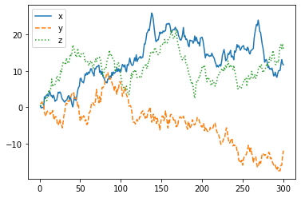

[](http://quantlet.de/)

## [](http://quantlet.de/) **TSP_SimNormRW** [](http://quantlet.de/)

```yaml


Name of Quantlet:    'TSP_SimNormRW'

Published in:        'Applied Time Series Analysis and Forecasting with Python'

Description:         'This Quantlet generates three simulated paths of a standard Gaussian random walk'

Keywords:            'simulation, random walk, Gaussian, normal'

Author:              Huang Changquan, Alla Petukhina


```



### PYTHON Code
```python

import numpy as np
import pandas as pd
from numpy.random import normal
import matplotlib.pyplot as plt
np.random.seed(1357)
a = normal(size = 300); b = normal(size = 300); c = normal(size = 300)
x = np.cumsum(a); y = np.cumsum(b); z = np.cumsum(c)
xyz = pd.DataFrame({'x': x, 'y': y, 'z': z})
xyz.index = range(1,301)
xyz.plot(style = ['-', '--', ':'])
plt.show()
```

automatically created on 2021-01-11